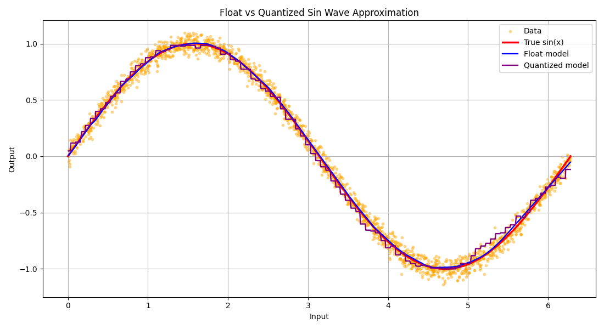
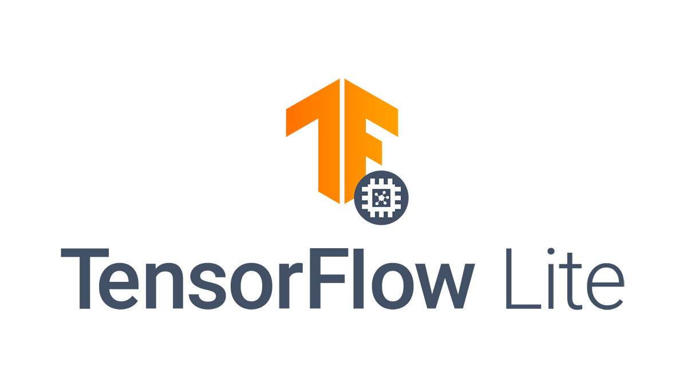

# _ESP-DL_ vs _ESP-TFLite-Micro_: Neural Networks Inference on ESP32 Devices

This repository accompanies a comparative study of two neural network inference frameworks for Espressif microcontrollers: **ESP-DL** and **ESP-TFLite-Micro**. Both approaches are applied to the same regression task—approximating the sine function $f(x) = \sin(x)$ over the domain $x \in [0, 2\pi]$—using an identical Multi-Layer Perceptron (MLP) with topology **input → 32 → 64 → 128 → output**.

<div style="text-align: center;">
    
</div>

The project provides a complete TinyML workflow: model training and export in Python, pre-built quantized model artifacts, and two standalone [ESP-IDF](https://docs.espressif.com/projects/esp-idf/en/latest/) firmware projects that run inference on-device and benchmark latency. The goal is to offer a practical reference for developers choosing between Espressif's hardware-optimized ESP-DL stack and Google's ecosystem-oriented TensorFlow Lite for Microcontrollers port.

> [!NOTE]
> For more details, please refer to the [technical report](IoT_ProjectWork_report.pdf).

## Training and export

Install the Python dependencies and run the training script from the repository root:

```bash
pip install -r requirements.txt
python src/sin_wave_predictor.py --target esp32s3
```

The `--target` flag selects the ESP32 variant for ESP-DL export (`c`, `esp32s3`, or `esp32p4`). The script generates synthetic sine-wave training data, trains the MLP, and produces:

- a **TFLite** model (int8 post-training quantization) for ESP-TFLite-Micro
- an **ONNX** intermediate model
- an **ESPDL** model (int8 quantization via ESP-PPQ) for ESP-DL

## ESP-TFLite-Micro

<div style="text-align: center;">
    
</div>

[ESP-TFLite-Micro](https://components.espressif.com/components/espressif/esp-tflite-micro) is Espressif's port of TensorFlow Lite for Microcontrollers. It uses an **interpreter-based** architecture: the model is stored as a standard `.tflite` FlatBuffer, converted into a C byte array, and executed at runtime through a pre-allocated **Tensor Arena** in SRAM. This approach prioritizes portability and integrates naturally with the TensorFlow/Keras training pipeline, supporting post-training quantization (PTQ) and quantization-aware training (QAT).

On supported targets, Espressif's [ESP-NN](https://github.com/espressif/esp-nn) library accelerates common operators (dense layers, convolutions, pooling, activations) by redirecting TFLM kernel calls to hardware-tuned implementations—most notably the SIMD/AI vector instructions on the ESP32-S3.

The firmware project lives in `sin_predictor_tflite/`. It loads the quantized model via `MicroInterpreter`, runs warmup and benchmark inference loops over the input range, and reports per-inference latency over the serial console.

### Generating model data for ESP-TFLite-Micro

To run the model with ESP-TFLite-Micro on the ESP32, it must be converted into a C-style byte array (`const unsigned char[]`) so it can be compiled directly into the firmware's Read-Only Memory (Flash). Given the quantized TFLite model file (`model_quantized.tflite`), there are two options:

1. **Linux/MacOS**: Use the `xxd` command-line tool to convert the TFLite file into a C header file. This tool is typically pre-installed on Linux and MacOS systems.

    ```bash
    # Run the xxd conversion
    xxd -i model_quantized.tflite > model_data.cc
    ```

2. **Windows**: Use the `xxd` command-line tool from the Git for Windows package. As an alternative, use the WSL (Windows Subsystem for Linux) to run the same tool.

    ```bash
    # Navigate to your Windows Desktop from the WSL terminal
    cd /mnt/c/Users/YourWindowsUsername/Desktop

    # Run the xxd conversion in WSL
    xxd -i model_quantized.tflite > model_data.cc
    ```

After running the command, you will find a new file named `model_data.cc` in the same directory. This file contains the TFLite model as a C-style byte array, which can be included in your ESP32 firmware project.

## ESP-DL

<div style="text-align: center;">
    
</div>

[ESP-DL](https://github.com/espressif/esp-dl) is Espressif's native inference library, designed to maximize performance on ESP silicon. It uses a **bare-metal execution** strategy with a proprietary `.espdl` model format based on FlatBuffers for zero-copy deserialization directly from flash. A static memory planner allocates layer buffers before the first inference, avoiding dynamic allocation and the monolithic Tensor Arena required by TFLM.

Model quantization for ESP-DL is performed with [ESP-PPQ](https://github.com/espressif/esp-ppq) (ESP Post-training Production Quantization), which converts an ONNX model into a target-specific `.espdl` file. The framework also exploits hardware features such as SIMD instructions on the ESP32-S3 and dual-core scheduling for compute-intensive operations.

The firmware project lives in `sin_predictor_espdl/`. The `.espdl` model is embedded at build time via CMake (`target_add_aligned_binary_data`) into the component for the selected target (`esp32` or `esp32s3`). At runtime, the application loads the model from flash, performs int8-quantized inference over the sine input range, and logs benchmark latency results.

Pre-generated `.espdl` files are available under `models/<target>/` and are also copied into `sin_predictor_espdl/main/models/<target>/` for direct building.

## Repository layout

```
TinyML_esp32/
├── src/
│   └── sin_wave_predictor.py       # Train MLP and export TFLite / ONNX / ESPDL models
├── models/
│   ├── c/                          # Models exported for generic C / ESP32 target
│   │   ├── sin_wave_model.tflite
│   │   ├── sin_wave_model.onnx
│   │   ├── sin_wave_model.espdl
│   │   ├── sin_wave_model.cc       # TFLite model as C byte array
│   │   ├── sin_wave_model.json
│   │   └── sin_wave_model.info
│   └── esp32s3/                    # Models exported for ESP32-S3 target
│       └── ...
├── sin_predictor_tflite/           # ESP-IDF project (ESP-TFLite-Micro)
│   ├── CMakeLists.txt
│   ├── main/
│   │   ├── main.cc                 # Inference benchmark application
│   │   ├── sin_wave_model.cc       # Embedded TFLite model
│   │   ├── sin_wave_model.h
│   │   └── idf_component.yml
│   └── .devcontainer/
├── sin_predictor_espdl/            # ESP-IDF project (ESP-DL)
│   ├── CMakeLists.txt
│   ├── main/
│   │   ├── app_main.cpp            # Inference benchmark application
│   │   ├── models/
│   │   │   ├── esp32/
│   │   │   │   └── sin_wave_model.espdl
│   │   │   └── esp32s3/
│   │   │       └── sin_wave_model.espdl
│   │   └── idf_component.yml
│   └── .devcontainer/
├── media/                          # Plots and framework logos
├── requirements.txt                # Python dependencies
├── IoT_ProjectWork_report.pdf      # Technical report
├── LICENSE
└── README.md
```
